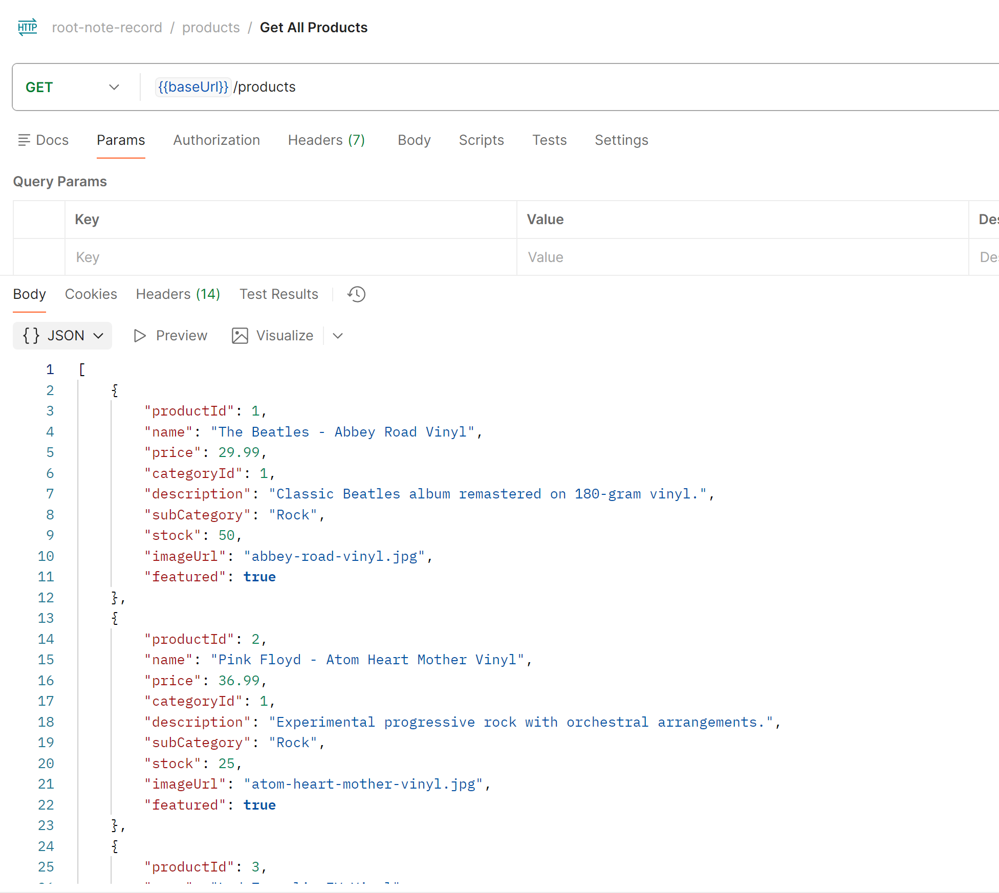
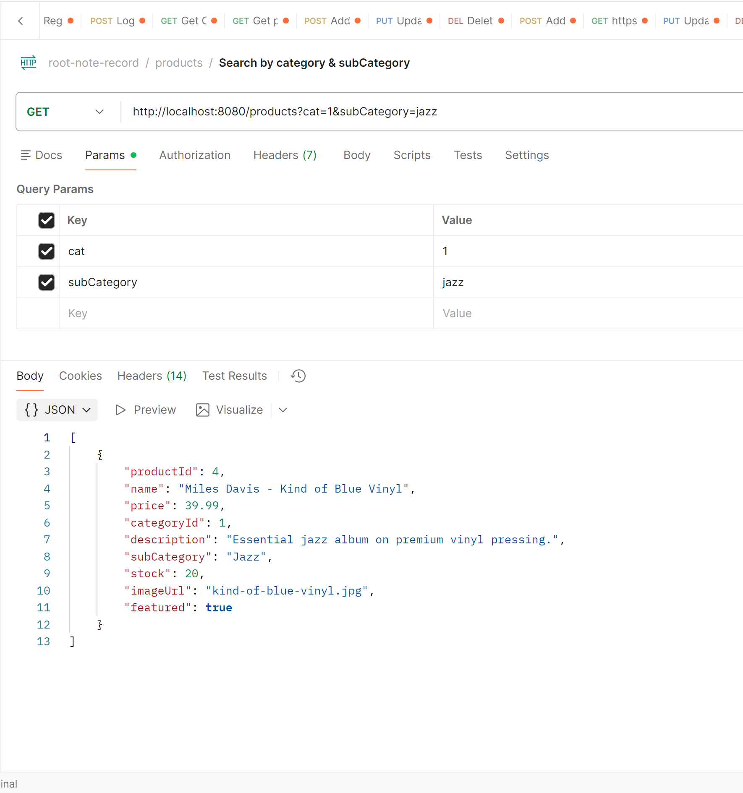
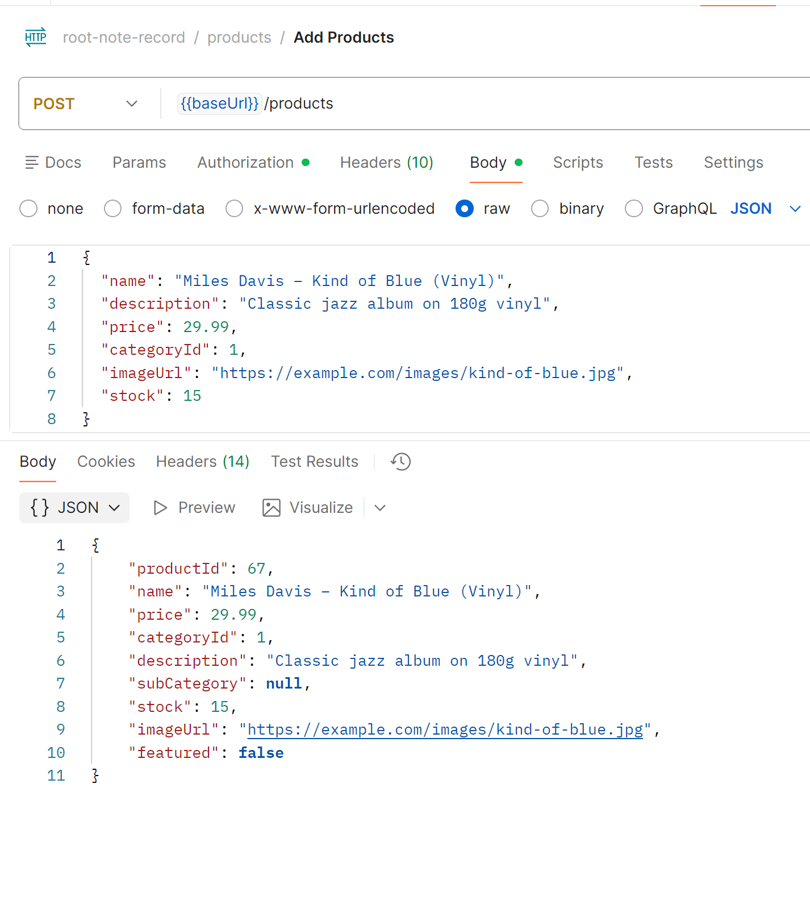
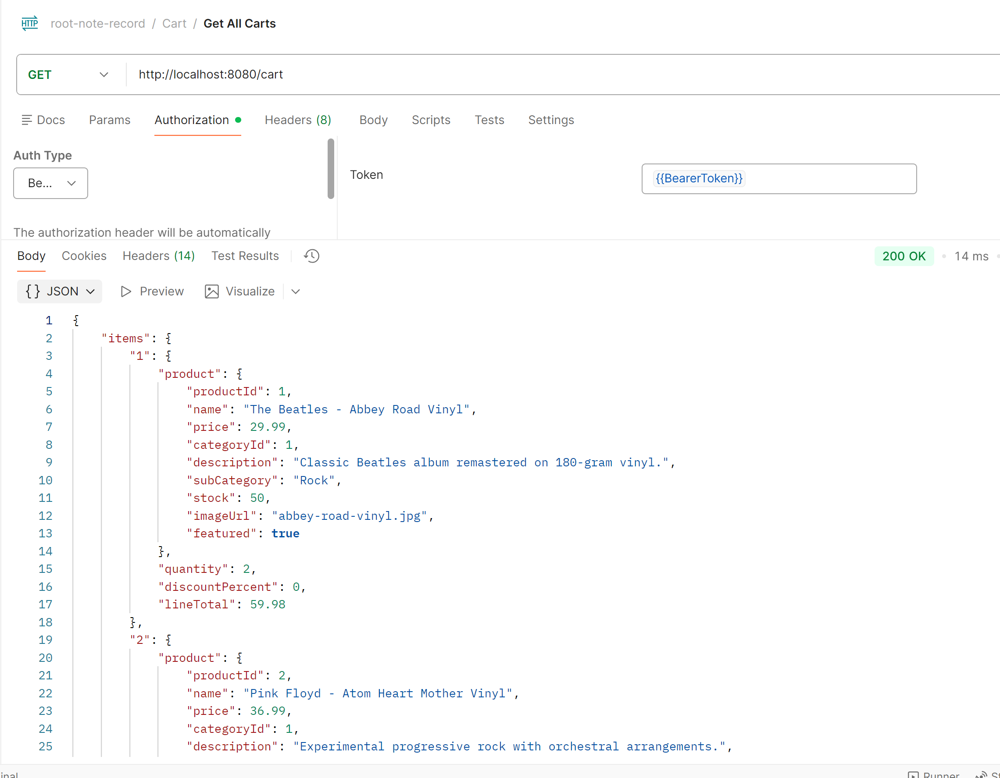

# 🎵 Root Note Records – E-Commerce API

Root Note Records is a full-stack e-commerce backend API built for an online record store.  
It provides secure authentication, product browsing, category management, and a persistent shopping cart experience for authenticated users.

This project was developed as a capstone to demonstrate **RESTful API design**, **Spring Boot**, **JDBC/MySQL**, and **secure user-based data handling**.

---

## 🚀 Features

- 🔐 JWT-based authentication & authorization
- 📦 Product and category browsing
- 🔎 Advanced product search (category, price range, sub-category)
- 🛒 Persistent shopping cart per user
- 👤 User-specific cart data stored in MySQL
- 🌐 Frontend integration via REST API

---
# Screen Shots 

### Get All Products


### Product Search with Filters


### Add Product to Shopping Cart


### Get Shopping Cart for Logged-in User


---

## 🧠 Highlighted Code: Persistent Shopping Cart Logic

One of the most interesting parts of this project is the **shopping cart persistence logic**, which allows users to log out and log back in without losing their cart items.

### Example: Add Product to Cart (DAO Layer)

```java
@Override
public void addProduct(int userId, int productId)
{
    String sql = """
        INSERT INTO shopping_cart (user_id, product_id, quantity)
        VALUES (?, ?, 1)
        ON DUPLICATE KEY UPDATE quantity = quantity + 1
        """;

    try (Connection connection = getConnection();
         PreparedStatement statement = connection.prepareStatement(sql))
    {
        statement.setInt(1, userId);
        statement.setInt(2, productId);
        statement.executeUpdate();
    }
}
```
### Why this is interesting
- Uses a composite primary key (user_id, product_id)

- Prevents duplicate rows in the shopping cart table

- Automatically increments quantity when the same product is added again

- Stores cart state in the database instead of memory

- Mirrors real-world e-commerce cart behavior

This design ensures scalability and persistence across sessions.

---

### 🛠️ Tech Stack
- Java 17
- Spring Boot
- Spring Security with JWT
- MySQL
- JDBC
- RESTful APIs
- PostMan(API testing)

---
### 📌 Project Status
- Core API complete
- Product and category management implemented
- Shopping cart fully functional
- API tested with Postman
- Ready for presentation and submission

---

## 🔗 Related Repository

- **Frontend Client:**  
  [root-note-records-client] https://github.com/Estif017/root-note-records-client
